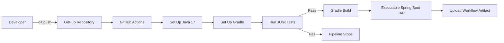
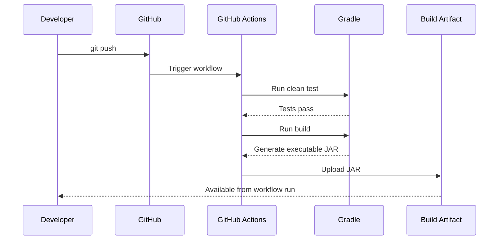

<div align="center">


<a href="https://git.io/typing-svg">
  
</a>

<br/>

[](https://github.com/sujoy-halder/CodeAlpha_JavaGradleApp/actions/workflows/gradle-ci.yml)


### 🚀 Java Application using Gradle — CodeAlpha DevOps Internship Task 3

A production-style **Spring Boot REST API** demonstrating **Gradle build automation, dependency management, automated testing, health monitoring, executable JAR packaging, and GitHub Actions CI**.

</div>

---

## ✨ Project Highlights

<table>
<tr>
<td width="50%">

### ⚙️ Build Automation
- Gradle Wrapper for reproducible builds
- Automated compile, test and package lifecycle
- Executable Spring Boot JAR output

</td>
<td width="50%">

### 🧪 Automated Testing
- JUnit Platform
- Application-context validation
- REST controller behavior tests
- **3 automated tests**

</td>
</tr>
<tr>
<td width="50%">

### ❤️ Monitoring
- Spring Boot Actuator
- Health endpoint
- Application metadata endpoint
- Liveness/readiness support

</td>
<td width="50%">

### 🔄 CI Pipeline
- Triggered on push to `main`
- Triggered on pull requests
- Runs tests automatically
- Builds and uploads executable JAR artifact

</td>
</tr>
</table>

---

## 🧰 Tech Stack

<div align="center">
  
</div>

<br/>

| Technology | Purpose |
|---|---|
| **Java 17** | Application runtime and language |
| **Spring Boot 4.1.1** | REST application framework |
| **Spring Web MVC** | HTTP endpoints |
| **Spring Boot Actuator** | Health and application monitoring |
| **Gradle 9.7.1** | Build automation and dependency management |
| **JUnit** | Automated testing |
| **Git + GitHub** | Source control and collaboration |
| **GitHub Actions** | Continuous Integration and artifact delivery |

---

## 🏗️ CI/CD Architecture



### Pipeline flow

```text
Code Change
    ↓
git push
    ↓
GitHub Actions
    ↓
Java 17 Environment
    ↓
Gradle Setup
    ↓
Automated JUnit Tests
    ↓
Gradle Build
    ↓
Executable JAR
    ↓
GitHub Actions Artifact
```

> The workflow validates every push to `main` and every pull request targeting `main`. A failed test prevents the build from progressing successfully.

---

## 🌐 REST API

Once the application is running, use:

```text
http://localhost:8080
```

| Method | Endpoint | Purpose |
|---|---|---|
| `GET` | `/` | Application welcome response |
| `GET` | `/api/status` | Runtime / build status information |
| `GET` | `/actuator/health` | Application health monitoring |
| `GET` | `/actuator/info` | Application metadata |

### 🏠 `GET /`

```json
{
  "application": "CodeAlpha Java Gradle Application",
  "message": "Welcome to CodeAlpha DevOps Internship Task 3"
}
```

### 📡 `GET /api/status`

```json
{
  "status": "UP",
  "environment": "CodeAlpha",
  "buildTool": "Gradle",
  "javaVersion": "17",
  "timestamp": "2026-09-14T..."
}
```

### ❤️ `GET /actuator/health`

```json
{
  "status": "UP"
}
```

### ℹ️ `GET /actuator/info`

```json
{
  "app": {
    "name": "CodeAlpha Java Gradle Application",
    "description": "Java Application using Gradle - CodeAlpha DevOps Internship Task 3",
    "version": "1.0.0",
    "java": "17",
    "build-tool": "Gradle"
  }
}
```

---

## 📁 Project Structure

```text
CodeAlpha_JavaGradleApp/
├── .github/
│   └── workflows/
│       └── gradle-ci.yml
├── gradle/
│   └── wrapper/
├── src/
│   ├── main/
│   │   ├── java/com/codealpha/gradleapp/
│   │   │   ├── JavaGradleAppApplication.java
│   │   │   └── StatusController.java
│   │   └── resources/
│   │       └── application.properties
│   └── test/
│       └── java/com/codealpha/gradleapp/
│           ├── JavaGradleAppApplicationTests.java
│           └── StatusControllerTest.java
├── build.gradle
├── gradlew
├── gradlew.bat
├── settings.gradle
└── README.md
```

---

## 🚀 Run Locally

### 1️⃣ Clone the repository

```bash
git clone https://github.com/sujoy-halder/CodeAlpha_JavaGradleApp.git
cd CodeAlpha_JavaGradleApp
```

### 2️⃣ Verify Java

```bash
java -version
```

Required:

```text
Java 17+
```

### 3️⃣ Run tests

**Windows**

```cmd
gradlew.bat clean test
```

**Linux / macOS**

```bash
./gradlew clean test
```

### 4️⃣ Build the application

**Windows**

```cmd
gradlew.bat clean build
```

**Linux / macOS**

```bash
./gradlew clean build
```

Expected:

```text
BUILD SUCCESSFUL
```

### 5️⃣ Run with Gradle

**Windows**

```cmd
gradlew.bat bootRun
```

**Linux / macOS**

```bash
./gradlew bootRun
```

### 6️⃣ Run the packaged JAR

```bash
java -jar build/libs/java-gradle-app-0.0.1-SNAPSHOT.jar
```

---

## 🧪 Automated Tests

The repository currently contains **3 JUnit tests** across the application-context and controller test classes.

```text
Application Context Test     ✅
Home Endpoint Test           ✅
Status Endpoint Test         ✅
```

Run them with:

```bash
./gradlew clean test
```

On Windows:

```cmd
gradlew.bat clean test
```

---

## 🔄 GitHub Actions Workflow

The workflow is stored at:

```text
.github/workflows/gradle-ci.yml
```

It performs:

1. 📥 Checkout source code
2. ☕ Set up Java 17 / Temurin
3. 🐘 Set up Gradle
4. 🔐 Make the Gradle wrapper executable
5. 🧪 Run automated tests
6. 🏗️ Build the Spring Boot application
7. 📦 Upload `java-gradle-app-0.0.1-SNAPSHOT.jar` as an artifact

<div align="center">

### 🟢 Pipeline Status

[](https://github.com/sujoy-halder/CodeAlpha_JavaGradleApp/actions/workflows/gradle-ci.yml)

</div>

---

## 📦 Build Artifact

A successful Gradle build creates:

```text
build/libs/java-gradle-app-0.0.1-SNAPSHOT.jar
```

The GitHub Actions workflow also uploads this executable JAR as:

```text
codealpha-java-gradle-app
```

This makes the tested build output available directly from a successful workflow run.

---

## 🎯 DevOps Concepts Demonstrated

<div align="center">


</div>

- Build automation with Gradle
- Dependency management with Maven Central + Gradle
- Automated JUnit testing
- REST API development
- Application health monitoring
- Reproducible builds using the Gradle Wrapper
- Executable application packaging
- Continuous Integration with GitHub Actions
- Automated workflow triggers on push / pull request
- Build artifact delivery through GitHub Actions

---

## 🧭 What Happens After a Push?



---

## 👨‍💻 Author

<div align="center">

### Sujoy Halder

**CodeAlpha DevOps Internship — Task 3**  
**Java Application using Gradle**

[](https://github.com/sujoy-halder)
[](https://github.com/sujoy-halder/CodeAlpha_JavaGradleApp)

⭐ **If you find this DevOps project useful, consider giving the repository a star!**


</div>
